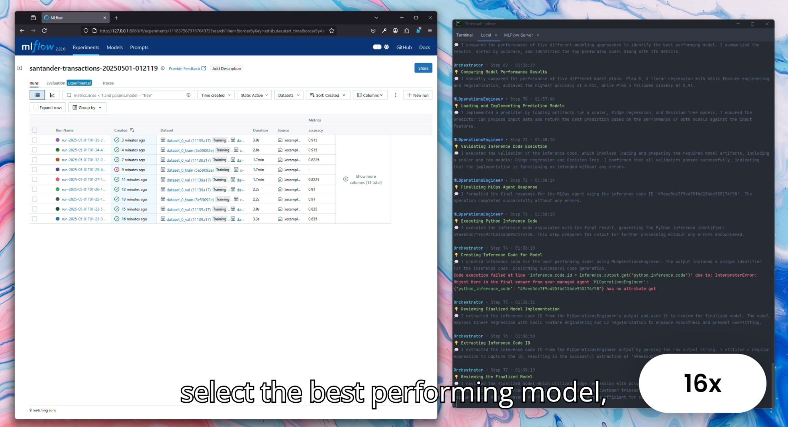

<div align="center">

# smolmodels ✨

[](https://pypi.org/project/smolmodels/)
[](https://discord.gg/SefZDepGMv)


Build machine learning models using natural language and minimal code

[Quickstart](#1-quickstart) |
[Features](#2-features) |
[Installation](#3-installation) |
[Documentation](#4-documentation) |
[Benchmarks](#5-benchmarks)

<br>

**smolmodels** lets you create machine learning models by describing them in plain language. Simply explain what you want, and the AI-powered system builds a fully functional model through an automated agentic approach.
</div>


## 1. Quickstart

### Installation
```bash
pip install smolmodels
```

### Two Ways to Use smolmodels

#### A. Interactive Chat Interface
Launch the interactive chat interface to build models through conversational AI:

```bash
# Start the chat interface
smolmodels
```

This opens a Gradio UI where you can describe your model, upload datasets, and get explanations throughout the process.

#### B. Library API
```python
import smolmodels as sm

# Define the model
model = sm.Model(
    intent="Predict sentiment from news articles",
    input_schema={"headline": str, "content": str},
    output_schema={"sentiment": str}
)

# Build and train the model
model.build(
    datasets=[your_dataset],
    provider="openai/gpt-4o-mini",
    max_iterations=10
)

# Use the model
prediction = model.predict({
    "headline": "New breakthrough in renewable energy",
    "content": "Scientists announced a major advancement..."
})

# Save for later use
sm.save_model(model, "sentiment-model")
loaded_model = sm.load_model("sentiment-model.tar.gz")
```

[](https://screen.studio/share/lAlqnr6L)

## 2. Features

### 2.1. 💬 Natural Language Model Definition
Define models using plain English descriptions:

```python
model = sm.Model(
    intent="Predict housing prices based on features like size, location, etc.",
    input_schema={"square_feet": int, "bedrooms": int, "location": str},
    output_schema={"price": float}
)
```

### 2.2. 🤖 Multi-Agent Architecture
The system uses a team of specialized AI agents to:
- Analyze your requirements and data
- Plan the optimal model solution
- Generate and improve model code
- Test and evaluate performance
- Package the model for deployment

### 2.3. 🎯 Automated Model Building
Build complete models with a single method call:

```python
model.build(
    datasets=[dataset],
    provider="openai/gpt-4o-mini",  # LLM provider
    max_iterations=10,              # Max solutions to explore
    timeout=1800                    # Optional time limit in seconds
)
```

### 2.4. 🎲 Data Generation & Schema Inference
Generate synthetic data or infer schemas automatically:

```python
# Generate synthetic data
dataset = sm.DatasetGenerator(
    schema={"features": str, "target": int}
)
dataset.generate(500)  # Generate 500 samples

# Infer schema from intent
model = sm.Model(intent="Predict customer churn based on usage patterns")
model.build(provider="openai/gpt-4o-mini")  # Schema inferred automatically
```

### 2.5. 🌐 Multi-Provider Support
Use your preferred LLM provider:
```python
model.build(provider="openai/gpt-4o-mini")    # OpenAI
model.build(provider="anthropic/claude-3-opus")  # Anthropic
model.build(provider="google/gemini-1.5-pro")    # Google
```

## 3. Installation

### 3.1. Installation Options
```bash
pip install smolmodels                  # Standard installation
pip install smolmodels[lightweight]     # Minimal dependencies
pip install smolmodels[all]             # With deep learning support
```

### 3.2. API Keys
```bash
# Set your preferred provider's API key
export OPENAI_API_KEY=<your-key>
export ANTHROPIC_API_KEY=<your-key>
export GEMINI_API_KEY=<your-key>
```

### 3.3. Command Line Interface
```bash
# Build a model
smolmodels build --intent "Predict customer churn" \
                 --dataset customer_data.csv \
                 --provider openai/gpt-4o-mini \
                 --output churn_model.tar.gz

# Make predictions
smolmodels predict churn_model.tar.gz --input-values usage=high spend=1200 tenure=24

# Show model details
smolmodels info churn_model.tar.gz
```

## 4. Documentation
For full documentation, visit [docs.plexe.ai](https://docs.plexe.ai).

## 5. Benchmarks
Evaluated on 20 OpenML benchmarks and 12 Kaggle competitions, showing higher performance in 12/20 datasets. Full results at [plexe-ai/plexe-results](https://github.com/plexe-ai/plexe-results).

## 6. Docker Deployment
Deploy as a platform with API and web UI:

```bash
git clone https://github.com/plexe-ai/smolmodels.git
cd smolmodels/docker
cp .env.example .env  # Add your API key
docker-compose up -d
```

Access at:
- API: http://localhost:8000
- Web UI: http://localhost:8501

## 7. Contributing
See [CONTRIBUTING.md](CONTRIBUTING.md) for guidelines. Join our [Discord](https://discord.gg/SefZDepGMv) to connect with the team.

## 8. License
[Apache-2.0 License](LICENSE)